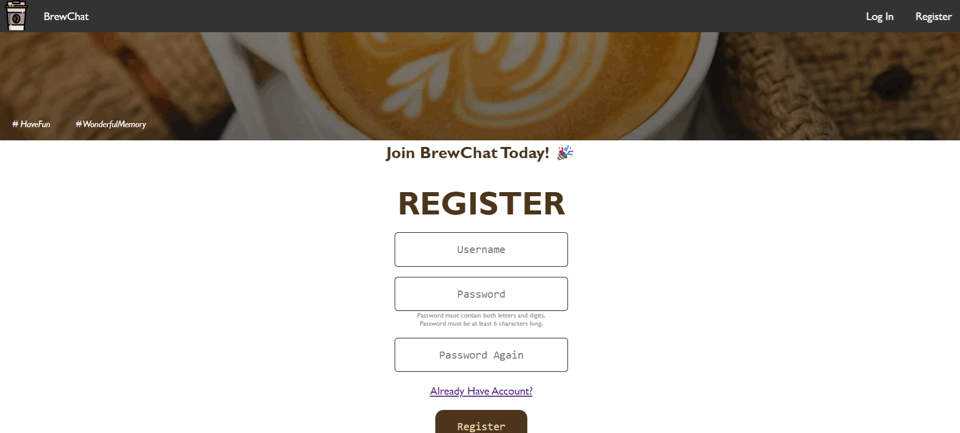

# BrewChat Application



## Table of contents
* [Purpose](#general-info)
* [Architecture](#architecture)
* [Technologies](#technologies)
* [Launch](#launch)
* [Test](#test)
* [Commit Log](#commit)
* [Source](#source)


## Purpose of the Web Application <a name = "general-info"></a>

BrewChat is a Flask-based chat application designed for coffee lovers. It connects users with a shared passion for coffee, allowing them to engage in conversations, share stories, and explore various coffee topics. The daily matching system pairs users with a random conversation partner each day, fostering diverse interactions. With Eliza, a 24/7 chatbot, users can ask coffee-related questions and receive insightful responses. BrewChat aims to recreate the serendipitous encounters of a coffee shop setting, providing companionship and knowledge exchange for coffee enthusiasts.

## Architecture of the web application<a name = "architecture"></a>

BrewChat is built using HTML, CSS, Flask, AJAX, jQuery, and the SQLAlchemy database framework, with the chat function powered by Socket.IO. Here's an overview of the application's architecture:

- Client-side (Frontend): The client-side of BrewChat encompasses the user interface developed using HTML, CSS, and JavaScript. It provides an intuitive and visually appealing experience to users, allowing them to interact with the application. AJAX and jQuery are utilized for asynchronous requests and dynamic UI updates, enhancing the user experience.

- Server-side (Backend): The server-side of BrewChat is built using the Flask web framework, which handles the server-side logic and serves the application's routes. Flask enables the processing of client requests, performs business logic, and communicates with databases and other services. Flask-SocketIO facilitates real-time bidirectional communication between clients and the server for chat functionality.

- Chatbot (Backend): BrewChat incorporates the Eliza Chatbot as part of the backend functionality. The Eliza Chatbot, implemented using the Natural Language Toolkit (NLTK), enables chat-based conversations with users. It processes user input, performs natural language processing, generates appropriate responses, and communicates with the client-side interface.

- Database: BrewChat utilizes the SQLAlchemy database framework to interact with the SQLite database. The SQLite database stores user information, conversation pairings, and relevant chat logs. SQLAlchemy provides an Object-Relational Mapping (ORM) tool, simplifying database operations within the application.

The BrewChat web application combines Flask, SocketIO, and SQLAlchemy for smooth real-time communication in the chat feature. Additionally, the integration of the Eliza chatbot enhances user engagement, replicating the serendipity of coffee shop encounters.

## Technologies <a name = "technologies"></a>
- Python version: 3.8.2 or 3.9.6
- Flask version: 2.3.1
- Werkzeug version: 2.3.1
- SQLAlchemy version: 2.0.12

## Launch <a name = "launch"></a>

### Create an environment

Create a project folder and a venv folder within:

```bash
python3 -m venv venv
```

### Activate the environment

Before you work on your project, activate the corresponding environment:

- macOS user:

```bash
. venv/bin/activate
```

- Microsoft Windows user:

```bash
venv\Scripts\activate
```

### Install all requirements

```bash
pip3 install -r requirements.txt
```

### Database setting

Initialize database

```bash
flask db init
flask db migrate -m "build tables"
flask db upgrade
```

### Run Web App

```bash
flask --app brewchat.py --debug run
```
If not work, try `export FLASK_APP=brewchat.py`

## Test <a name = "test"></a>
The BrewChat application includes a suite of unit tests to ensure the correctness and functionality of the various components. These tests are designed to cover different aspects of the application and help identify any potential issues or bugs.
The application also includes a suite of Selenium tests to verify the end-to-end functionality and user experience. These tests simulate user interactions with the application in a browser environment.

### Set up Test

Change to the project directory
```
cd tests
```
### How to run

Run the unit test and selenium tests using the following command
```
python3 -m unittest test_authUser.py
python3 -m unittest test_unauthUser.py
python3 -m unittest test_validate.py
python3 -m unittest test_db.py
python3 test_selenium.py # need to flask run in the background
```
#### Unit Tests

The unit tests in the BrewChat application focus on testing individual components and functionalities in isolation. They help ensure that each component behaves as expected and that the application as a whole functions correctly. These tests cover various scenarios and edge cases to validate the behavior of the code.

Below are a few examples of unit tests implemented for the BrewChat application:

- **Example Unit Test: Login functionality**
    This test suite for testing the login functionality of the BrewChat web application. It includes test cases for validating the login process with different scenarios:

    1. `test_valid_login`: This test case verifies that a user can successfully log in with the correct username and password. It creates a test user, sets their password, performs a login request with the correct credentials, and checks if the login is successful.

    2. `test_invalid_login_wrong_password`: This test case checks the behavior when an incorrect password is provided during the login process. It creates a test user, sets their password, performs a login request with an incorrect password, and verifies that the login fails.

    3. `test_invalid_login_nonexisting_user`: This test case validates the behavior when a non-existing user attempts to log in. It performs a login request with incorrect credentials and checks that the login fails.

    These tests help ensure that the login functionality of the BrewChat application behaves as expected and handles different scenarios correctly.

#### Selenium Tests

The Selenium tests in BrewChat are designed to verify the end-to-end functionality and user experience of the application. These tests simulate user interactions with the application in a browser environment, allowing us to test the application's behavior from a user's perspective. They help identify potential issues related to user workflows, page navigation, form submissions, and more.

Below are a examples of Selenium tests implemented for the BrewChat application:

- **Example Selenium Test: First Time to Use BrewChat**

  This test simulates a user's first visit to BrewChat and performs the following steps:

  1. User visits the register page
  2. User inputs username and password
  3. User clicks the register button
  4. Asserts that the page redirects to the login page
  5. User inputs username and password on the login page
  6. User clicks the login button
  7. Asserts that the page redirects to the index page

  This test verifies the registration and login functionality, ensuring that a user can successfully register, login, and access the main index page.

These tests, combined with the unit tests, help maintain the quality and reliability of the BrewChat application by catching potential issues early in the development process.

## Source <a name = "source"></a>
This app is inspired by the Flask Mega-Tutorial  by [@Miguel Grinberg](https://blog.miguelgrinberg.com/post/the-flask-mega-tutorial-part-i-hello-world)